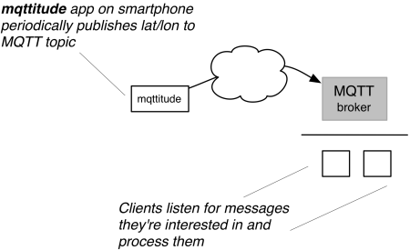

# MQTTitude

MQTTitude is an app (well, two apps actually -- one for Android, and another for iOS),
which allow a device to periodically publish its location status to an [MQTT]
broker. If you've previously used Google Latitude, you can think of this as a a
_decentralized Google Latitude_. MQTTitude was started because Google Latitude
was de-comissioned in August 2013.

Whether you want to keep track of your own location or that of a family member (with
their consent, of course), MQTTitude will let you do that in a safe way.

* MQTTitude uses [TLS] to communicate with a broker. (You can disable TLS if you
  know you don't want it.)
* MQTTitude encourages you to use your own broker so that you know where the
  location data goes to.
* MQTTitude is extensible: you can handle the location data received by the
  broker in any which way you desire.

## Components

There are three components to MQTTitude (and a whole slew of useful things you can do
with them):

* The _App_, or front-end which runs on a supported device. This reports location
  data to the [MQTT] broker. The app will be made available for iOS on the App store and for
  Android on Google Play.
* The MQTT broker is the service with which the App talks. You set up your own
  broker (which is easy to do) or use an existing broker, for example one of the
  test brokers or that of a friend. The important thing is: _MQTTitude doesn't enforce
  a particular broker on you_! You are free to choose where your data is stored.
* The MQTTitude back-end.

Both the App and the back-end talk to the broker (as shown in the diagram below).
You can also have other programs obtain the data from the broker (MQTTitude
uses [JSON] for which there is support in almost any language you can imagine.)

 

## Getting started

Before you get all excited and install the app, you need an [MQTT] broker. We
recommend you set one up yourself, on a Raspberry Pi, say, or use one of the [existing
public brokers][publicbroker]. If you choose the latter, be aware that your
location data will no longer be private: anybody can find it and follow you on
one of the public brokers.

Once you have decided on the broker to use, you can install and configure the
MQTTitude app itself. Configuration entails setting things like the broker's
address and the topic on which you want to publish your device's location.

## Terminology

* Messages in MQTT are published on topics. A _topic_ string is used to publish
  and to subscribe to/from an MQTT broker. 
  Some valid examples are
```
/location/mom
myphone/jane/loca
```

* _QoS_ or Quality of Service, specifies how the app should attempt to publish
  to an MQTT broker, and knows three values:

  0. The message is delivered at most once, or it is not delivered at all. Its delivery across the network is not acknowledged.
  1. The message is always delivered at least once. If the sender does not receive an acknowledgment, the message is sent again with the DUP flag set until an acknowledgment is received. As a result receiver can be sent the same message multiple times, and might process it multiple times.
  2. The message is always delivered exactly once. This is the safest but slowest method of transfer.

* Retain means that the MQTT broker will attempt to store a published message
  on a particular topic. Some brokers do not support retained messages.


  [MQTT]: http://mqtt.org
  [JSON]: http://json.org
  [TLS]: http://en.wikipedia.org/wiki/Transport_Layer_Security
  [publicbroker]: http://mqtt.org/wiki/doku.php/public_brokers
