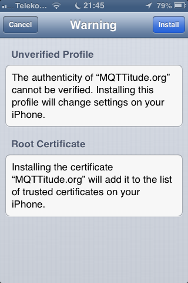
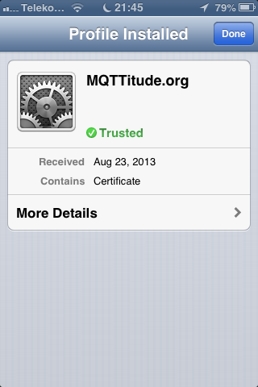

# Setting up TLS on your mobile device

You want data between your mobile device (a.k.a. smartphone) and the MQTT broker you use to be secured from eavesdropping. This is accomplished using [TLS] (the artist formerly known as SSL). When you configure your broker you will generate what is called a CA certificate which is basically a large amount of bits. The file you'll be creating in fact looks like this (in what is called [PEM] format; but you don't really want to know that).

```
-----BEGIN CERTIFICATE-----
MIIDGTCCAoKgAwIBAgIJAODXne2yV51zMA0GCSqGSIb3DQEBBQUAMGcxCzAJBgNV
BAYTAkRFMQwwCgYDVQQIEwNOUlcxETAPBgNVBAcTCElyZ2VuZHdvMRYwFAYDVQQK
...
pjGM/XgBs62UhqXnoHrHh/AHIiHieuNFwOhUg0fD/vQ5O6UZkJTWY5LLmEyPN5sS
cPZ5pT/WCvGuIOgNdy1VyWJrrlAjeQlbK+GDcNc=
-----END CERTIFICATE-----
```

That's plain text, even though it doesn't look like it, and you can share it (though not many people will want it ...) It's so public, that it's perfectly OK to send yourself the file by, say, e-mail.

We show you here how to set up your iOS or Android device with that kind of certificate.

In both cases we assume you've got an e-mail in your inbox with the file you've sent yourself. This file has a `.crt` extension, and in both Android and iOS you can simply launch configuration by clicking on the attachment.

In our example, the CA certificate is called `MQTTitude-ca.crt`.

## Android

Note that by following these instructions on Android you'll be prompted to set a device PIN or pattern to protect the device. If you already have that, just carry on. If you absolutely don't want to do that, you should download the certificate into, say, the Downloads folder, and configure it manually in MQTTitude.

So, here's your e-mail message with said attachment.


Now click on the attached file, and you'll get the following dialog where you have to specify a name for the certificate (sigh: the certificate contains a name, but Android wants you to name it anyway). Give it any old name. We've chosen `MQTTitude`, of course. Then click OK.


That's it. You're done, and if you no longer require the certificate file just delete the e-mail, though we recommend you keep it around for a bit.


## iOS

So, here's your e-mail containing the certificate file. Click on it to launch the profile installer. No worries: we're not going to break anything. We're just adding yet another certificate to iOS' certificate store, and you're going to say that you trust that certificate. You ought to trust it: you've just created it yourself!


You've clicked, and here's the trust store. You see the certificate has a name, but it's not trusted yet. Click on Install.


Read the text. If you must. Just kidding: honestly, it's ok. But do read the text.



There you go! That's it: the certificate was installed.



You're done, and if you no longer require the certificate file just delete the e-mail, though we recommend you keep it around for a bit.

  [TLS]: http://en.wikipedia.org/wiki/Transport_Layer_Security
  [PEM]: http://en.wikipedia.org/wiki/Privacy_Enhanced_Mail
